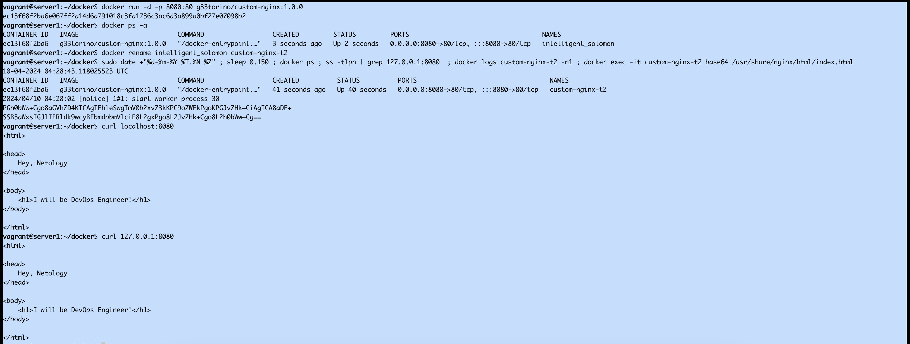

# Домашнее задание к занятию 4 «Оркестрация группой Docker контейнеров на примере Docker Compose»

### Инструкция к выполению

1. Для выполнения заданий обязательно ознакомьтесь с [инструкцией](https://github.com/netology-code/devops-materials/blob/master/cloudwork.MD) по экономии облачных ресурсов. Это нужно, чтобы не расходовать средства, полученные в результате использования промокода.
2. Практические задачи выполняйте на личной рабочей станции или созданной вами ранее ВМ в облаке.
3. Своё решение к задачам оформите в вашем GitHub репозитории в формате markdown!!!
4. В личном кабинете отправьте на проверку ссылку на .md-файл в вашем репозитории.

## Задача 1

Сценарий выполнения задачи:
- Установите docker и docker compose plugin на свою linux рабочую станцию или ВМ.
- Зарегистрируйтесь и создайте публичный репозиторий  с именем "custom-nginx" на https://hub.docker.com;
- скачайте образ nginx:1.21.1;
- Создайте Dockerfile и реализуйте в нем замену дефолтной индекс-страницы(/usr/share/nginx/html/index.html), на файл index.html с содержимым:

```
<html>
<head>
Hey, Netology
</head>
<body>
<h1>I will be DevOps Engineer!</h1>
</body>
</html>
```
- Соберите и отправьте созданный образ в свой dockerhub-репозитории c tag 1.0.0 . 
- Предоставьте ответ в виде ссылки на https://hub.docker.com/<username_repo>/custom-nginx/general .

```
    https://hub.docker.com/repository/docker/g33torino/custom-nginx/general
```
## Задача 2
1. Запустите ваш образ custom-nginx:1.0.0 командой docker run в соответвии с требованиями:
- имя контейнера "ФИО-custom-nginx-t2"
- контейнер работает в фоне
- контейнер опубликован на порту хост системы 127.0.0.1:8080
2. Переименуйте контейнер в "custom-nginx-t2"
3. Выполните команду ```date +"%d-%m-%Y %T.%N %Z" ; sleep 0.150 ; docker ps ; ss -tlpn | grep 127.0.0.1:8080  ; docker logs custom-nginx-t2 -n1 ; docker exec -it custom-nginx-t2 base64 /usr/share/nginx/html/index.html```
4. Убедитесь с помощью curl или веб браузера, что индекс-страница доступна.

    ```
    vagrant@server1:~/docker$ docker run -d -p 8080:80 g33torino/custom-nginx:1.0.0
    ec13f68f2ba6e067ff2a14d6a791018c3fa1736c3ac6d3a899a0bf27e07098b2
    vagrant@server1:~/docker$ docker ps -a
    CONTAINER ID   IMAGE                          COMMAND                  CREATED         STATUS         PORTS                                   NAMES
    ec13f68f2ba6   g33torino/custom-nginx:1.0.0   "/docker-entrypoint.…"   3 seconds ago   Up 2 seconds   0.0.0.0:8080->80/tcp, :::8080->80/tcp   intelligent_solomon
    vagrant@server1:~/docker$ docker rename intelligent_solomon custom-nginx-t2
    vagrant@server1:~/docker$ sudo date +"%d-%m-%Y %T.%N %Z" ; sleep 0.150 ; docker ps ; ss -tlpn | grep 127.0.0.1:8080  ; docker logs custom-nginx-t2 -n1 ; docker exec -it custom-nginx-t2 base64 /usr/share/nginx/html/index.html
    10-04-2024 04:28:43.118025523 UTC
    CONTAINER ID   IMAGE                          COMMAND                  CREATED          STATUS          PORTS                                   NAMES
    ec13f68f2ba6   g33torino/custom-nginx:1.0.0   "/docker-entrypoint.…"   41 seconds ago   Up 40 seconds   0.0.0.0:8080->80/tcp, :::8080->80/tcp   custom-nginx-t2
    2024/04/10 04:28:02 [notice] 1#1: start worker process 30
    PGh0bWw+Cgo8aGVhZD4KICAgIEhleSwgTmV0b2xvZ3kKPC9oZWFkPgoKPGJvZHk+CiAgICA8aDE+
    SSB3aWxsIGJlIERldk9wcyBFbmdpbmVlciE8L2gxPgo8L2JvZHk+Cgo8L2h0bWw+Cg==
    vagrant@server1:~/docker$ curl localhost:8080
    <html>
    
    <head>
        Hey, Netology
    </head>
    
    <body>
        <h1>I will be DevOps Engineer!</h1>
    </body>
    
    </html>
    vagrant@server1:~/docker$ curl 127.0.0.1:8080
    <html>
    
    <head>
        Hey, Netology
    </head>
    
    <body>
        <h1>I will be DevOps Engineer!</h1>
    </body>
    
    </html>
```

В качестве ответа приложите скриншоты консоли, где видно все введенные команды и их вывод.



## Задача 3
1. Воспользуйтесь docker help или google, чтобы узнать как подключиться к стандартному потоку ввода/вывода/ошибок контейнера "custom-nginx-t2".
2. Подключитесь к контейнеру и нажмите комбинацию Ctrl-C.

```
    vagrant@server1:~/docker$ docker start custom-nginx-t2
    custom-nginx-t2
    vagrant@server1:~/docker$ docker attach custom-nginx-t2
    ^C2024/04/10 04:49:33 [notice] 1#1: signal 2 (SIGINT) received, exiting
    2024/04/10 04:49:33 [notice] 23#23: exiting
    2024/04/10 04:49:33 [notice] 23#23: exit
    2024/04/10 04:49:33 [notice] 1#1: signal 17 (SIGCHLD) received from 23
    2024/04/10 04:49:33 [notice] 1#1: worker process 23 exited with code 0
    2024/04/10 04:49:33 [notice] 1#1: exit
```
3. Выполните ```docker ps -a``` и объясните своими словами почему контейнер остановился.

vagrant@server1:~/docker$ docker ps -a
CONTAINER ID   IMAGE                          COMMAND                  CREATED          STATUS                      PORTS     NAMES
ec13f68f2ba6   g33torino/custom-nginx:1.0.0   "/docker-entrypoint.…"   21 minutes ago   Exited (0) 5 seconds ago              custom-nginx-t2

Комбинация клавиш Ctrl-c в контексте docker attach отправляет сигнал остановки (SIGINT) внутри контейнера. 
Этот сигнал обычно интерпретируется как просьба остановить выполнение процесса, 
а в случае запущенного интерактивного процесса в контейнере это может привести к завершению работы контейнера

4. Перезапустите контейнер

    vagrant@server1:~/docker$ docker start custom-nginx-t2
    custom-nginx-t2

5. Зайдите в интерактивный терминал контейнера "custom-nginx-t2" с оболочкой bash.

    vagrant@server1:~/docker$ docker exec -it custom-nginx-t2 /bin/bash

6. Установите любимый текстовый редактор(vim, nano итд) с помощью apt-get.

    root@ec13f68f2ba6:/# apt-get update
    Get:1 http://security.debian.org/debian-security buster/updates InRelease [34.8 kB]
    Get:2 http://deb.debian.org/debian buster InRelease [122 kB]
    Get:3 http://deb.debian.org/debian buster-updates InRelease [56.6 kB]
    Get:4 http://security.debian.org/debian-security buster/updates/main amd64 Packages [595 kB]
    Get:5 http://deb.debian.org/debian buster/main amd64 Packages [7909 kB]
    Get:6 http://deb.debian.org/debian buster-updates/main amd64 Packages [8788 B]
    Fetched 8726 kB in 3s (2773 kB/s)
    Reading package lists... Done
    root@ec13f68f2ba6:/# apt-get install nano
    Reading package lists... Done
    Building dependency tree
    Reading state information... Done
    Suggested packages:
      spell
    The following NEW packages will be installed:
      nano
    0 upgraded, 1 newly installed, 0 to remove and 56 not upgraded.
    Need to get 544 kB of archives.
    After this operation, 2269 kB of additional disk space will be used.
    Get:1 http://deb.debian.org/debian buster/main amd64 nano amd64 3.2-3 [544 kB]
    Fetched 544 kB in 1s (970 kB/s)
    debconf: delaying package configuration, since apt-utils is not installed
    Selecting previously unselected package nano.
    (Reading database ... 7638 files and directories currently installed.)
    Preparing to unpack .../archives/nano_3.2-3_amd64.deb ...
    Unpacking nano (3.2-3) ...
    Setting up nano (3.2-3) ...
    update-alternatives: using /bin/nano to provide /usr/bin/editor (editor) in auto mode
    update-alternatives: warning: skip creation of /usr/share/man/man1/editor.1.gz because associated file /usr/share/man/man1/nano.1.gz (of link group editor) doesn't exist
    update-alternatives: using /bin/nano to provide /usr/bin/pico (pico) in auto mode
    update-alternatives: warning: skip creation of /usr/share/man/man1/pico.1.gz because associated file /usr/share/man/man1/nano.1.gz (of link group pico) doesn't exist

7. Отредактируйте файл "/etc/nginx/conf.d/default.conf", заменив порт "listen 80" на "listen 81".

    root@ec13f68f2ba6:/# nano /etc/nginx/conf.d/default.conf

8. Запомните(!) и выполните команду ```nginx -s reload```, а затем внутри контейнера ```curl http://127.0.0.1:80 ; curl http://127.0.0.1:81```.

root@ec13f68f2ba6:/# nginx -s reload
2024/04/10 04:57:45 [notice] 310#310: signal process started
root@ec13f68f2ba6:/# curl http://127.0.0.1:80 ; curl http://127.0.0.1:81
curl: (7) Failed to connect to 127.0.0.1 port 80: Connection refused
<html>

<head>
    Hey, Netology
</head>

<body>
    <h1>I will be DevOps Engineer!</h1>
</body>

</html>

9. Выйдите из контейнера, набрав в консоли  ```exit``` или Ctrl-D.
10. Проверьте вывод команд: ```ss -tlpn | grep 127.0.0.1:8080``` , ```docker port custom-nginx-t2```, ```curl http://127.0.0.1:8080```. Кратко объясните суть возникшей проблемы.

Изменение конфигурации веб-сервера nginx внутри контейнера  влияет исключительно на работу самого nginx. Проброшенные порты с хоста на контейнер остаются без изменений.

12. Удалите запущенный контейнер "custom-nginx-t2", не останавливая его.(воспользуйтесь --help или google)

vagrant@server1:~/docker$ docker rm -f custom-nginx-t2
custom-nginx-t2

В качестве ответа приложите скриншоты консоли, где видно все введенные команды и их вывод.

## Задача 4


- Запустите первый контейнер из образа ***centos*** c любым тегом в фоновом режиме, подключив папку  текущий рабочий каталог ```$(pwd)``` на хостовой машине в ```/data``` контейнера, используя ключ -v.
- Запустите второй контейнер из образа ***debian*** в фоновом режиме, подключив текущий рабочий каталог ```$(pwd)``` в ```/data``` контейнера. 
- Подключитесь к первому контейнеру с помощью ```docker exec``` и создайте текстовый файл любого содержания в ```/data```.
- Добавьте ещё один файл в текущий каталог ```$(pwd)``` на хостовой машине.
- Подключитесь во второй контейнер и отобразите листинг и содержание файлов в ```/data``` контейнера.

    vagrant@server1:~$ docker run -dti -v $(pwd):/data --name centos centos:latest /bin/bash
    a5ab7df5420105b0359173bffa1c00dff580e072b1b6063ad2f8f52b78b3c512
    vagrant@server1:~$ docker run -dti -v $(pwd):/data --name debian debian:latest /bin/bash
    bcf3e1d1def2257ab041692e627f86bd60a534c559ae6adba5fa0f9d0e5f3a6c
    vagrant@server1:~$ docker ps -a
    CONTAINER ID   IMAGE                          COMMAND                  CREATED          STATUS                      PORTS     NAMES
    bcf3e1d1def2   debian:latest                  "/bin/bash"              5 seconds ago    Up 4 seconds                          debian
    a5ab7df54201   centos:latest                  "/bin/bash"              19 seconds ago   Up 18 seconds                         centos
    8663b4052b1d   g33torino/custom-nginx:1.0.0   "/docker-entrypoint.…"   50 minutes ago   Exited (0) 50 minutes ago             musing_gauss
    vagrant@server1:~$ docker exec -ti centos /bin/bash
    [root@a5ab7df54201 /]# touch ./data/temp
    [root@a5ab7df54201 /]# exit
    exit
    vagrant@server1:~$ touch temp2
    vagrant@server1:~$ docker exec -ti debian /bin/bash
    root@bcf3e1d1def2:/# cd data
    root@bcf3e1d1def2:/data# ls
    docker	temp  temp2
   


В качестве ответа приложите скриншоты консоли, где видно все введенные команды и их вывод.


## Задача 5

1. Создайте отдельную директорию(например /tmp/netology/docker/task5) и 2 файла внутри него.
"compose.yaml" с содержимым:
```
version: "3"
services:
  portainer:
    image: portainer/portainer-ce:latest
    network_mode: host
    ports:
      - "9000:9000"
    volumes:
      - /var/run/docker.sock:/var/run/docker.sock
```
"docker-compose.yaml" с содержимым:
```
version: "3"
services:
  registry:
    image: registry:2
    network_mode: host
    ports:
    - "5000:5000"
```

И выполните команду "docker compose up -d". Какой из файлов был запущен и почему? (подсказка: https://docs.docker.com/compose/compose-application-model/#the-compose-file )

    Путь по умолчанию для файла Compose — compose.yaml(предпочтительный) или compose.ymlон находится в рабочем каталоге. Compose также поддерживает docker-compose.yamlобратную docker-compose.ymlсовместимость более ранних версий. Если оба файла существуют, Compose предпочитает канонический compose.yaml.

2. Отредактируйте файл compose.yaml так, чтобы были запущенны оба файла. (подсказка: https://docs.docker.com/compose/compose-file/14-include/)

    version: "3"
    include:
      - docker-compose.yaml
    services:
      portainer:
        image: portainer/portainer-ce:latest
        network_mode: host
        ports:
          - "9000:9000"
        volumes:
          - /var/run/docker.sock:/var/run/docker.sock


3. Выполните в консоли вашей хостовой ОС необходимые команды чтобы залить образ custom-nginx как custom-nginx:latest в запущенное вами, локальное registry. Дополнительная документация: https://distribution.github.io/distribution/about/deploying/
4. Откройте страницу "https://127.0.0.1:9000" и произведите начальную настройку portainer.(логин и пароль адмнистратора)
5. Откройте страницу "http://127.0.0.1:9000/#!/home", выберите ваше local  окружение. Перейдите на вкладку "stacks" и в "web editor" задеплойте следующий компоуз:

```
version: '3'

services:
  nginx:
    image: 127.0.0.1:5000/custom-nginx
    ports:
      - "9090:80"
```
6. Перейдите на страницу "http://127.0.0.1:9000/#!/2/docker/containers", выберите контейнер с nginx и нажмите на кнопку "inspect". В представлении <> Tree разверните поле "Config" и сделайте скриншот от поля "AppArmorProfile" до "Driver".

7. Удалите любой из манифестов компоуза(например compose.yaml).  Выполните команду "docker compose up -d". Прочитайте warning, объясните суть предупреждения и выполните предложенное действие. Погасите compose-проект ОДНОЙ(обязательно!!) командой.

vagrant@server1:~$ docker compose up -d
WARN[0000] Found multiple config files with supported names: /home/vagrant/compose.yaml, /home/vagrant/docker-compose.yaml
WARN[0000] Using /home/vagrant/compose.yaml
WARN[0000] Found multiple config files with supported names: /home/vagrant/compose.yaml, /home/vagrant/docker-compose.yaml
WARN[0000] Using /home/vagrant/compose.yaml
WARN[0000] /home/vagrant/docker-compose.yaml: `version` is obsolete
WARN[0000] /home/vagrant/compose.yaml: `version` is obsolete
[+] Running 4/4
 ✔ Container vagrant-registry-1                                         Started                                                0.6s
 ✔ Container vagrant-portainer-1                                        Started                                                0.5s
 ! registry Published ports are discarded when using host network mode                                                         0.0s
 ! portainer Published ports are discarded when using host network mode                                                        0.0s
vagrant@server1:~$ cd docker
vagrant@server1:~/docker$ docker build -t custom-nginx:latest .
[+] Building 2.1s (8/8) FINISHED                                                                                     docker:default
 => [internal] load build definition from Dockerfile                                                                           0.0s
 => => transferring dockerfile: 106B                                                                                           0.0s
 => [internal] load metadata for docker.io/library/nginx:1.21.1                                                                1.8s
 => [auth] library/nginx:pull token for registry-1.docker.io                                                                   0.0s
 => [internal] load .dockerignore                                                                                              0.0s
 => => transferring context: 2B                                                                                                0.0s
 => [internal] load build context                                                                                              0.0s
 => => transferring context: 143B                                                                                              0.0s
 => [1/2] FROM docker.io/library/nginx:1.21.1@sha256:a05b0cdd4fc1be3b224ba9662ebdf98fe44c09c0c9215b45f84344c12867002e          0.0s
 => CACHED [2/2] COPY ./index.html /usr/share/nginx/html/index.html                                                            0.0s
 => exporting to image                                                                                                         0.0s
 => => exporting layers                                                                                                        0.0s
 => => writing image sha256:6042fc33bf7438dc7fd4a3202fda691ce33091ded07af0a3fb208dffd73b20e7                                   0.0s
 => => naming to docker.io/library/custom-nginx:latest                                                                         0.0s
vagrant@server1:~/docker$ docker tag custom-nginx:latest localhost:5000/custom-nginx:latest
vagrant@server1:~/docker$ docker push localhost:5000/custom-nginx:latest
The push refers to repository [localhost:5000/custom-nginx]
db9319176349: Pushed
d47e4d19ddec: Pushed
8e58314e4a4f: Pushed
ed94af62a494: Pushed
875b5b50454b: Pushed
63b5f2c0d071: Pushed
d000633a5681: Pushed
latest: digest: sha256:ae30f2e930209b6f93de844d0f7a8adfdc65b3a021b58d82e9758046edc01bba size: 1777
vagrant@server1:~/docker$ docker ps -a
CONTAINER ID   IMAGE                           COMMAND                  CREATED              STATUS              PORTS     NAMES
aeacc5f0b0b1   portainer/portainer-ce:latest   "/portainer"             About a minute ago   Up About a minute             vagrant-portainer-1
fd9f4bda3228   registry:2                      "/entrypoint.sh /etc…"   About a minute ago   Up About a minute             vagrant-registry-1
vagrant@server1:~/docker$ docker images
REPOSITORY                    TAG       IMAGE ID       CREATED         SIZE
g33torino/custom-nginx        1.0.0     6042fc33bf74   12 hours ago    133MB
custom-nginx                  latest    6042fc33bf74   12 hours ago    133MB
localhost:5000/custom-nginx   latest    6042fc33bf74   12 hours ago    133MB
debian                        latest    e15dbfac2d2b   14 hours ago    117MB
registry                      2         9363667f8aec   3 weeks ago     25.4MB
localhost:5000/custom-nginx   <none>    a13e502f89a6   7 weeks ago     187MB
portainer/portainer-ce        latest    1a0fb356ea35   4 months ago    294MB
hello-world                   latest    d2c94e258dcb   11 months ago   13.3kB
centos                        latest    5d0da3dc9764   2 years ago     231MB
vagrant@server1:~/docker$ docker run -d  6042fc33bf74
42cf73a9fa5cad6a03132b14598ca2b190675c0453e6c0ebb8d4956f2e0caa0a
vagrant@server1:~/docker$ docker ps -a
CONTAINER ID   IMAGE                           COMMAND                  CREATED              STATUS              PORTS     NAMES
42cf73a9fa5c   6042fc33bf74                    "/docker-entrypoint.…"   9 seconds ago        Up 9 seconds        80/tcp    keen_lichterman
aeacc5f0b0b1   portainer/portainer-ce:latest   "/portainer"             About a minute ago   Up About a minute             vagrant-portainer-1
fd9f4bda3228   registry:2                      "/entrypoint.sh /etc…"   About a minute ago   Up About a minute             vagrant-registry-1


В качестве ответа приложите скриншоты консоли, где видно все введенные команды и их вывод, файл compose.yaml , скриншот portainer c задеплоенным компоузом.


